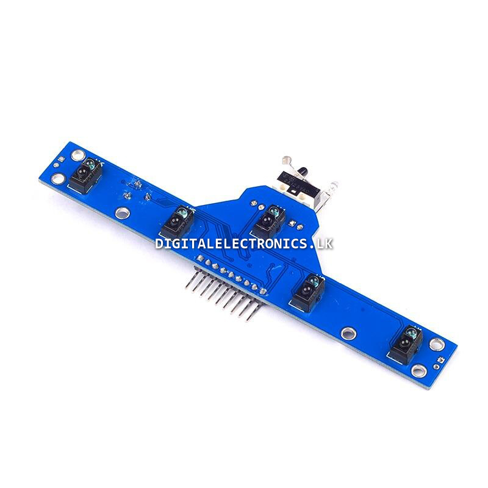

## TCRT5000 Sensor Array Library (C/C++)
* Library to use the TCRT5000 Sensor Array (Analog).
   
|       |
| :-------------------------------------: |
| *TCRT5000 Sensor Array* |

## How to use ?   
* Include the library and call the constructor `TCRTSensors`:
```C++
#include "TCRTSensors.h"

#define NUM_TCRT_SENSORS 5
 
uint8_t tcrtPins = {A0, A1, A2, A3, A4};
TCRTSensors tcrt(tcrtPins, NUM_TCRT_SENSORS);

void setup()
{
    // Calibration (Optional)
    for(uint8_t i = 0; i < 10; i++)
    {
        tcrt.calibrate();
        delay(10);
    }
...
}
  
void loop()
{
...
uint16_t pos = tcrt.readLineWhite(); // Relative position in relation to white line. 
                                     // For black line, use readLineBlack.
uint16_t error = pos - ((NUM_TCRT_SENSORS - 1) * 150) / 2;
...
}
```